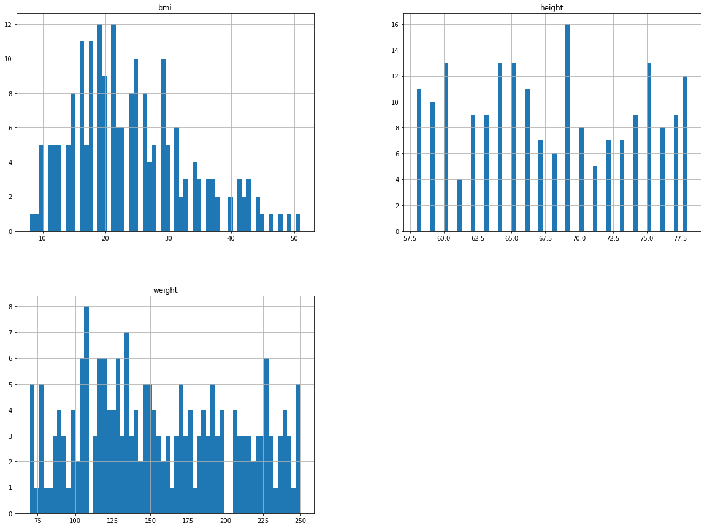
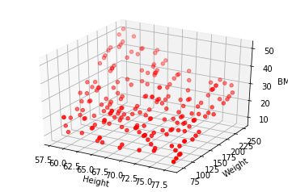
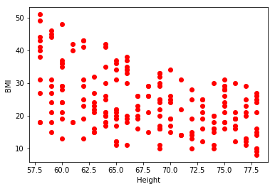
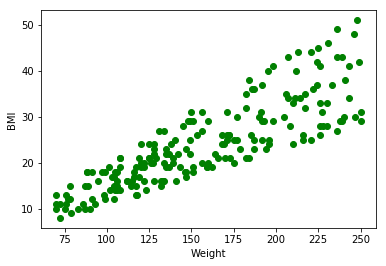

BMIPrediction
=============

The problem
-----------
This is a simple project to study prediction of BMI values using the sklearn in-built algorithms. 
Given height in pounds and weight in inches, the task is to predict BMI.

The formula for BMI is weight / (height * height) * 703.


```python
import os
import pandas as pd

def load_bmi_data():
    csv_path = "./bmidata.csv"
    return pd.read_csv(csv_path)

# It loads the CSV data file from the same directory as the notebook and describes the data
bmi_data = load_bmi_data()
bmi_data.head()
```


<div>

<table border="1" class="dataframe">
  <thead>
    <tr style="text-align: right;">
      <th></th>
      <th>height</th>
      <th>weight</th>
      <th>bmi</th>
    </tr>
  </thead>
  <tbody>
    <tr>
      <th>0</th>
      <td>64</td>
      <td>125</td>
      <td>21.0</td>
    </tr>
    <tr>
      <th>1</th>
      <td>78</td>
      <td>210</td>
      <td>24.0</td>
    </tr>
    <tr>
      <th>2</th>
      <td>68</td>
      <td>172</td>
      <td>26.0</td>
    </tr>
    <tr>
      <th>3</th>
      <td>69</td>
      <td>198</td>
      <td>29.0</td>
    </tr>
    <tr>
      <th>4</th>
      <td>58</td>
      <td>88</td>
      <td>18.0</td>
    </tr>
  </tbody>
</table>
</div>


```python
bmi_data.info()
bmi_data.describe()
```

    <class 'pandas.core.frame.DataFrame'>
    RangeIndex: 200 entries, 0 to 199
    Data columns (total 3 columns):
    height    200 non-null int64
    weight    200 non-null int64
    bmi       200 non-null float64
    dtypes: float64(1), int64(2)
    memory usage: 4.8 KB


<div>

<table border="1" class="dataframe">
  <thead>
    <tr style="text-align: right;">
      <th></th>
      <th>height</th>
      <th>weight</th>
      <th>bmi</th>
    </tr>
  </thead>
  <tbody>
    <tr>
      <th>count</th>
      <td>200.000000</td>
      <td>200.000000</td>
      <td>200.000000</td>
    </tr>
    <tr>
      <th>mean</th>
      <td>67.845000</td>
      <td>156.255000</td>
      <td>23.960000</td>
    </tr>
    <tr>
      <th>std</th>
      <td>6.196204</td>
      <td>50.558986</td>
      <td>9.192984</td>
    </tr>
    <tr>
      <th>min</th>
      <td>58.000000</td>
      <td>70.000000</td>
      <td>8.000000</td>
    </tr>
    <tr>
      <th>25%</th>
      <td>63.000000</td>
      <td>116.750000</td>
      <td>17.000000</td>
    </tr>
    <tr>
      <th>50%</th>
      <td>67.500000</td>
      <td>149.000000</td>
      <td>22.000000</td>
    </tr>
    <tr>
      <th>75%</th>
      <td>74.000000</td>
      <td>196.000000</td>
      <td>29.000000</td>
    </tr>
    <tr>
      <th>max</th>
      <td>78.000000</td>
      <td>250.000000</td>
      <td>51.000000</td>
    </tr>
  </tbody>
</table>
</div>


```python
%matplotlib inline
import matplotlib.pyplot as plt
bmi_data.hist(bins=60, figsize=(20,15))
plt.show()
```





```python
# From the CSV file, separate X and Y, where Y represents the labels and X represents the tuple containing height and weight
X_temp = bmi_data.copy()
X = X_temp.drop("bmi", axis=1)

Y_temp = bmi_data.copy()
Y = Y_temp.drop("height", axis=1).drop("weight", axis=1)

print("Shape of X is :" + str(X.shape))
print("Shape of Y is : "  + str(Y.shape))
```

    Shape of X is :(200, 2)
    Shape of Y is : (200, 1)


Visualizing the data
--------------------

```python
# Plot the data on a 3D surface

import matplotlib.pyplot as plt
from mpl_toolkits.mplot3d import Axes3D
fig = plt.figure()
ax = fig.add_subplot(111, projection='3d')

ax.scatter(bmi_data["height"], bmi_data["weight"], bmi_data["bmi"], c='r')

ax.set_xlabel('Height')
ax.set_ylabel('Weight')
ax.set_zlabel('BMI')
```


    <matplotlib.text.Text at 0x11e76fe10>







```python
# Calculate the mean RMS error in prediction between actual and predicted values

from sklearn.metrics import mean_squared_error
import numpy as np

def print_rms_error(Y, Y_predict):
    lin_mse = mean_squared_error(Y, Y_predict)
    lin_rmse = np.sqrt(lin_mse)
    print("RMS error in prediction : " + str(lin_rmse))
```


```python
# Calculate the BMI given height in inches and weight in pounds

def calculate_bmi(height, weight):
    bmi = 1.0 * weight / (height * height) * 703
    return bmi
```


```python
# Let's define 5 test samples
X_test = np.zeros([5,2])
X_test[0][0] = 68
X_test[0][1] = 168

X_test[1][0] = 74
X_test[1][1] = 165

X_test[2][0] = 60
X_test[2][1] = 110

X_test[3][0] = 60
X_test[3][1] = 90

X_test[4][0] = 68
X_test[4][1] = 200
```

Now we train a linear regression model to fit the data, calculate the RMS error and test the predictions against X_test.


```python
from sklearn.linear_model import LinearRegression
from sklearn.metrics import mean_squared_error
import numpy as np

lin_reg = LinearRegression()
lin_reg.fit(X, Y)

Y_predict = lin_reg.predict(X)

print_rms_error(Y, Y_predict)

for sample in X_test:
    height = sample[0]
    weight = sample[1]
    test_sample = np.zeros((1,2))
    test_sample[0][0] = height
    test_sample[0][1] = weight
    bmi_predict = lin_reg.predict(test_sample)
    print("Height : " + str(height) + " Weight : " + str(weight) + " predicted BMI : " + str(bmi_predict[0]) + " Actual BMI : " + str(calculate_bmi(height, weight)))
```

    RMS error in prediction : 1.69545207201
    Height : 68.0 Weight : 168.0 predicted BMI : [ 25.70081678] Actual BMI : 25.5415224913
    Height : 74.0 Weight : 165.0 predicted BMI : [ 20.84033168] Actual BMI : 21.1824324324
    Height : 60.0 Weight : 110.0 predicted BMI : [ 22.39372687] Actual BMI : 21.4805555556
    Height : 60.0 Weight : 90.0 predicted BMI : [ 19.23639245] Actual BMI : 17.575
    Height : 68.0 Weight : 200.0 predicted BMI : [ 30.75255185] Actual BMI : 30.4065743945


Simple linear regression model didn't do a very good job of predicting the BMI values. This is understandable because the BMI formula is quadratic. Thus, we transform the data to polynomial of degree 2 and then run that through linear regression.


```python
from sklearn.preprocessing import PolynomialFeatures

poly_features = PolynomialFeatures(degree=2, include_bias=False)
X_poly = poly_features.fit_transform(X)

lin_reg = LinearRegression()
lin_reg.fit(X_poly, Y)
Y_predict = lin_reg.predict(X_poly)

print_rms_error(Y, Y_predict)

for sample in X_test:
    height = sample[0]
    weight = sample[1]
    test_sample = np.zeros((1,2))
    test_sample[0][0] = height
    test_sample[0][1] = weight
    test_sample_poly = poly_features.fit_transform(test_sample)
    bmi_predict = lin_reg.predict(test_sample_poly)
    print("Height : " + str(height) + " Weight : " + str(weight) + " predicted BMI : " + str(bmi_predict[0]) + " Actual BMI : " + str(calculate_bmi(height, weight)))
```

    RMS error in prediction : 0.337702788326
    Height : 68.0 Weight : 168.0 predicted BMI : [ 25.09958904] Actual BMI : 25.5415224913
    Height : 74.0 Weight : 165.0 predicted BMI : [ 20.6939305] Actual BMI : 21.1824324324
    Height : 60.0 Weight : 110.0 predicted BMI : [ 21.11200851] Actual BMI : 21.4805555556
    Height : 60.0 Weight : 90.0 predicted BMI : [ 17.22262807] Actual BMI : 17.575
    Height : 68.0 Weight : 200.0 predicted BMI : [ 30.08768237] Actual BMI : 30.4065743945


Thus, the quadratic polynomial model models the data much more accurately.


<b>Note:</b> This is just a toy project to play with scikit-learn algorithms. Thus, I have not implemented cross-validation error, regularization etc.
